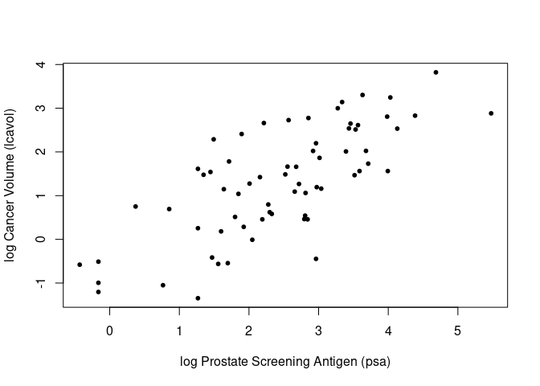
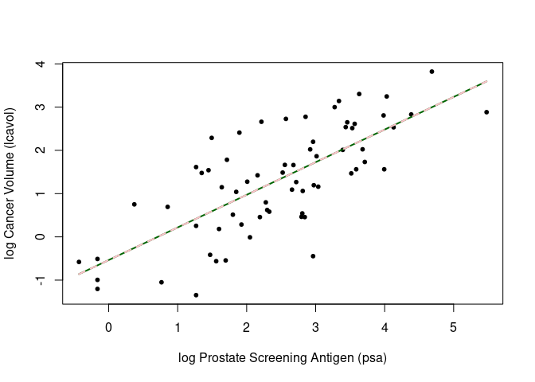
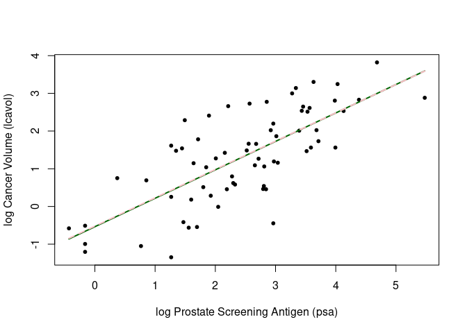
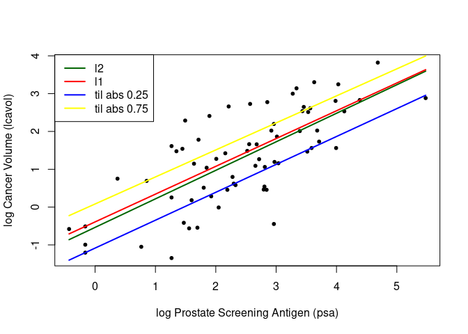

Homework 2
================
Mahmoud Hamza
February 20, 2022

``` r
## load prostate data
prostate <- 
  read.table(url(
    'https://web.stanford.edu/~hastie/ElemStatLearn/datasets/prostate.data'))

## subset to training examples
prostate_train <- subset(prostate, train==TRUE)

## plot lcavol vs lpsa
plot_psa_data <- function(dat=prostate_train) {
  plot(dat$lpsa, dat$lcavol,
       xlab="log Prostate Screening Antigen (psa)",
       ylab="log Cancer Volume (lcavol)",
       pch = 20)
}
plot_psa_data()
```

<!-- -->

``` r
############################
## regular linear regression
############################

## L2 loss function
L2_loss <- function(y, yhat)
  (y-yhat)^2

## fit simple linear model using numerical optimization
fit_lin <- function(y, x, loss=L2_loss, beta_init = c(-0.51, 0.75)) {
  err <- function(beta)
    mean(loss(y,  beta[1] + beta[2]*x))
  beta <- optim(par = beta_init, fn = err)
  return(beta)
}

## make predictions from linear model
predict_lin <- function(x, beta)
  beta[1] + beta[2]*x

## fit linear model
lin_beta <- fit_lin(y=prostate_train$lcavol,
                    x=prostate_train$lpsa,
                    loss=L2_loss)

## compute predictions for a grid of inputs
x_grid <- seq(min(prostate_train$lpsa),
              max(prostate_train$lpsa),
              length.out=100)
lin_pred <- predict_lin(x=x_grid, beta=lin_beta$par)

## plot data
plot_psa_data()

## plot predictions
lines(x=x_grid, y=lin_pred, col='darkgreen', lwd=2)

## do the same thing with 'lm'
lin_fit_lm <- lm(lcavol ~ lpsa, data=prostate_train)

## make predictins using 'lm' object
lin_pred_lm <- predict(lin_fit_lm, data.frame(lpsa=x_grid))

## plot predictions from 'lm'
lines(x=x_grid, y=lin_pred_lm, col='pink', lty=2, lwd=2)
```

<!-- -->

``` r
##################################
## try modifying the loss function
##################################

## custom loss function
custom_loss <- function(y, yhat)
  (y-yhat)^2 + abs(y-yhat)

## plot custom loss function
err_grd <- seq(-1,1,length.out=200)
plot(err_grd, custom_loss(err_grd,0), type='l',
     xlab='y-yhat', ylab='custom loss')
```

<!-- -->

``` r
## fit linear model with custom loss
lin_beta_custom <- fit_lin(y=prostate_train$lcavol,
                    x=prostate_train$lpsa,
                    loss=custom_loss)

lin_pred_custom <- predict_lin(x=x_grid, beta=lin_beta_custom$par)

## plot data
plot_psa_data()

## plot predictions from L2 loss
lines(x=x_grid, y=lin_pred, col='darkgreen', lwd=2)

## plot predictions from custom loss
lines(x=x_grid, y=lin_pred_custom, col='pink', lwd=2, lty=2)
```

<!-- -->

# Assignment

``` r
## L1 loss function
L1_loss <- function(y, yhat){
  abs(y-yhat)}

## tilted abs function
tilted_abs_0.25 <- function(y, yhat, tau = 0.25){
  ifelse(y-yhat >0, (y-yhat)*tau, (y-yhat) *(tau-1))
}

tilted_abs_0.75 <- function(y, yhat, tau = 0.75){
  ifelse(y-yhat >0, (y-yhat)*tau, (y-yhat) *(tau-1))
}

######### l2 ##########
## fit simple linear model using numerical optimization 
fit_lin <- function(y, x, loss = loss, beta_init = c(-0.51, 0.75)) {
  err <- function(beta)
    mean(loss(y,  beta[1] + beta[2]*x))
  beta <- optim(par = beta_init, fn = err)
  return(beta)
}

## grid of inputs
x_grid <- seq(min(prostate_train$lpsa),
              max(prostate_train$lpsa),
              length.out=100)

## make predictions from linear model
predict_lin <- function(x, beta){
  beta[1] + beta[2]*x
}
## fit linear model
lin_beta <- fit_lin(y=prostate_train$lcavol,
                    x=prostate_train$lpsa,
                    loss=L2_loss)

lin_pred <- predict_lin(x=x_grid, beta=lin_beta$par)

############ l1 ################

## fit linear model
lin_beta_l1 <- fit_lin(y=prostate_train$lcavol,
                    x=prostate_train$lpsa,
                    loss=L1_loss)

lin_pred_l1 <- predict_lin(x=x_grid, beta=lin_beta_l1$par)


############ tilted abs 0.25  ##############


## fit linear model
lin_beta_25 <- fit_lin(y=prostate_train$lcavol,
                    x=prostate_train$lpsa,
                    loss=tilted_abs_0.25)

lin_pred_25 <- predict_lin(x=x_grid, beta=lin_beta_25$par)


############ tilted abs 0.75  ##############


## fit linear model
lin_beta_75 <- fit_lin(y=prostate_train$lcavol,
                    x=prostate_train$lpsa,
                    loss=tilted_abs_0.75)

lin_pred_75 <- predict_lin(x=x_grid, beta=lin_beta_75$par)

## plot data
plot_psa_data()

## plot predictions
lines(x=x_grid, y=lin_pred, col='darkgreen', lwd=2)

lines(x=x_grid, y=lin_pred_l1, col='red', lwd=2)

lines(x=x_grid, y=lin_pred_25, col='blue', lwd=2)

lines(x=x_grid, y=lin_pred_75, col='yellow', lwd=2)

legend("topleft", 
  legend = c("l2", "l1", "til abs 0.25", "til abs 0.75"), col = c('darkgreen', 'red', 'blue', 'yellow'), lwd = 2)
```

<!-- -->

# Non linear

``` r
# Write functions to fit and predict from a simple nonlinear model with three parameters defined by 'beta[1] + beta[2]*exp(-beta[3]*x)'. Hint: make copies of 'fit_lin' and 'predict_lin' and modify them to fit the nonlinear model. Use c(-1.0, 0.0, -0.3) as 'beta_init'.


## L2 loss function
L2_loss <- function(y, yhat)
  (y-yhat)^2

## fit simple linear model using numerical optimization
fit_nonlin <- function(y, x, loss=loss, beta_init = c(-1.0, 0.0, -0.3)) {
  err <- function(beta)
    mean(loss(y,  beta[1] + beta[2]*exp(-beta[3]*x)))
  beta <- optim(par = beta_init, fn = err)
  return(beta)
}

## make predictions from linear model
predict_nonlin <- function(x, beta)
  beta[1] + beta[2]*exp(-beta[3]*x)

########## l2 #########################

## fit linear model
nonin_beta <- fit_nonlin(y=prostate_train$lcavol,
                    x=prostate_train$lpsa,
                    loss=L2_loss)

## compute predictions for a grid of inputs
nonin_pred <- predict_nonlin(x=x_grid, beta=nonin_beta$par)

################ l1 ##########################

## fit linear model
nonin_beta_l1 <- fit_nonlin(y=prostate_train$lcavol,
                    x=prostate_train$lpsa,
                    loss=L1_loss)

nonin_pred_l1 <- predict_nonlin(x=x_grid, beta=nonin_beta_l1$par)


############ tilted abs 0.25  ##############


## fit linear model
nonin_beta_25 <- fit_nonlin(y=prostate_train$lcavol,
                    x=prostate_train$lpsa,
                    loss=tilted_abs_0.25)

nonin_pred_25 <- predict_nonlin(x=x_grid, beta=nonin_beta_25$par)


############ tilted abs 0.75  ##############


## fit linear model
nonin_beta_75 <- fit_nonlin(y=prostate_train$lcavol,
                    x=prostate_train$lpsa,
                    loss=tilted_abs_0.75)

nonin_pred_75 <- predict_nonlin(x=x_grid, beta=nonin_beta_75$par)


## plot data
plot_psa_data()

## plot predictions
lines(x=x_grid, y=nonin_pred, col='darkgreen', lwd=2)

lines(x=x_grid, y=nonin_pred_l1, col='red', lwd=2)

lines(x=x_grid, y=nonin_pred_25, col='blue', lwd=2)

lines(x=x_grid, y=nonin_pred_75, col='yellow', lwd=2)

legend("topleft", 
  legend = c("l2", "l1", "til abs 0.25", "til abs 0.75"), col = c('darkgreen', 'red', 'blue', 'yellow'), lwd = 2)
```

<!-- -->
