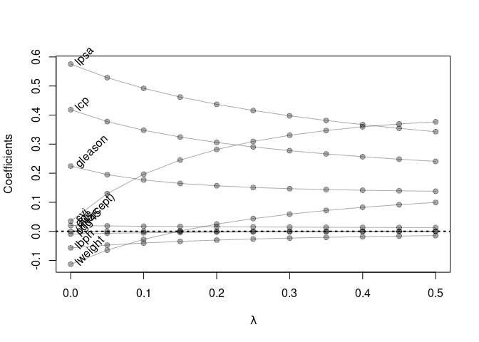

Homework 3
================
Mahmoud Hamza
February 21, 2022

``` r
library(tidyverse)
```

    ## ── Attaching packages ─────────────────────────────────────── tidyverse 1.3.1 ──

    ## ✓ ggplot2 3.3.5     ✓ purrr   0.3.4
    ## ✓ tibble  3.1.6     ✓ dplyr   1.0.7
    ## ✓ tidyr   1.1.4     ✓ stringr 1.4.0
    ## ✓ readr   2.1.1     ✓ forcats 0.5.1

    ## ── Conflicts ────────────────────────────────────────── tidyverse_conflicts() ──
    ## x dplyr::filter() masks stats::filter()
    ## x dplyr::lag()    masks stats::lag()

``` r
library(glmnet)
```

    ## Loading required package: Matrix

    ## 
    ## Attaching package: 'Matrix'

    ## The following objects are masked from 'package:tidyr':
    ## 
    ##     expand, pack, unpack

    ## Loaded glmnet 4.1-3

``` r
## load prostate data
prostate <- 
  read.table(url(
    'https://web.stanford.edu/~hastie/ElemStatLearn/datasets/prostate.data'))

## subset to training examples
prostate_train <- subset(prostate, train==TRUE) %>% 
  select(-train)
prostate_test <- subset(prostate, train==FALSE) %>% 
  select(-train)
```

## correlation matrix

``` r
round(cor(prostate_train), 2)
```

    ##         lcavol lweight  age  lbph   svi   lcp gleason pgg45 lpsa
    ## lcavol    1.00    0.30 0.29  0.06  0.59  0.69    0.43  0.48 0.73
    ## lweight   0.30    1.00 0.32  0.44  0.18  0.16    0.02  0.07 0.49
    ## age       0.29    0.32 1.00  0.29  0.13  0.17    0.37  0.28 0.23
    ## lbph      0.06    0.44 0.29  1.00 -0.14 -0.09    0.03 -0.03 0.26
    ## svi       0.59    0.18 0.13 -0.14  1.00  0.67    0.31  0.48 0.56
    ## lcp       0.69    0.16 0.17 -0.09  0.67  1.00    0.48  0.66 0.49
    ## gleason   0.43    0.02 0.37  0.03  0.31  0.48    1.00  0.76 0.34
    ## pgg45     0.48    0.07 0.28 -0.03  0.48  0.66    0.76  1.00 0.45
    ## lpsa      0.73    0.49 0.23  0.26  0.56  0.49    0.34  0.45 1.00

# Lease square regression model

``` r
fit <- lm(lcavol ~ ., data = prostate_train)

L2_loss <- function(y, yhat)
  (y-yhat)^2

error <- function(dat, fit, loss=L2_loss)
  mean(loss(dat$lcavol, predict(fit, newdata=dat)))

## train_error 
error(prostate_train, fit)
```

    ## [1] 0.4383709

``` r
## testing error
error(prostate_test, fit)
```

    ## [1] 0.5084068

## Lasso regression

``` r
## use glmnet to fit lasso
## glmnet fits using penalized L2 loss
## first create an input matrix and output vector
form  <- lcavol ~  lweight + age + lbph + lcp + pgg45 + lpsa + svi + gleason
x_inp <- model.matrix(form, data=prostate_train)
y_out <- prostate_train$lcavol
fit <- glmnet(x=x_inp, y=y_out, lambda=seq(0.5, 0, -0.05))
print(fit$beta)
```

    ## 9 x 11 sparse Matrix of class "dgCMatrix"

    ##    [[ suppressing 11 column names 's0', 's1', 's2' ... ]]

    ##                                                                        
    ## (Intercept) .         .         .         .         .         .        
    ## lweight     .         .         .         .         .         .        
    ## age         .         .         .         .         .         .        
    ## lbph        .         .         .         .         .         .        
    ## lcp         0.1473018 0.1714414 0.1955919 0.2197423 0.2438928 0.2680433
    ## pgg45       .         .         .         .         .         .        
    ## lpsa        0.2535992 0.2816134 0.3096214 0.3376294 0.3656374 0.3936454
    ## svi         .         .         .         .         .         .        
    ## gleason     .         .         .         .         .         .        
    ##                                                                         
    ## (Intercept) .         .            .            .            .          
    ## lweight     .         .            .            .           -0.113959029
    ## age         .         0.0006179005 0.005823836  0.010987417  0.020114429
    ## lbph        .         .            .           -0.004060083 -0.056959719
    ## lcp         0.2921937 0.3160341041 0.337951116  0.352226351  0.418442122
    ## pgg45       .         .            .            .           -0.009110807
    ## lpsa        0.4216534 0.4489636282 0.470877681  0.491246304  0.575583816
    ## svi         .         .            .            0.026126960  0.035184640
    ## gleason     .         .            .            0.011159844  0.224210312

``` r
## functions to compute testing/training error with glmnet
error <- function(dat, fit, lam, form, loss=L2_loss) {
  x_inp <- model.matrix(form, data=dat)
  y_out <- dat$lcavol
  y_hat <- predict(fit, newx=x_inp, s=lam)  ## see predict.elnet
  mean(loss(y_out, y_hat))
}

## train_error at lambda=0
error(prostate_train, fit, lam=0, form=form)
```

    ## [1] 0.4383709

``` r
## testing error at lambda=0
error(prostate_test, fit, lam=0, form=form)
```

    ## [1] 0.5084581

``` r
## train_error at lambda=0.03
error(prostate_train, fit, lam=0.05, form=form)
```

    ## [1] 0.4708637

``` r
## testing error at lambda=0.03
error(prostate_test, fit, lam=0.05, form=form)
```

    ## [1] 0.4945864

``` r
## plot path diagram
plot(x=range(fit$lambda),
     y=range(as.matrix(fit$beta)),
     type='n',
     xlab=expression(lambda),
     ylab='Coefficients')
for(i in 1:nrow(fit$beta)) {
  points(x=fit$lambda, y=fit$beta[i,], pch=19, col='#00000055')
  lines(x=fit$lambda, y=fit$beta[i,], col='#00000055')
}
text(x=0, y=fit$beta[,ncol(fit$beta)], 
     labels=rownames(fit$beta),
     xpd=NA, pos=4, srt=45)
abline(h=0, lty=3, lwd=2)
```

<!-- -->

``` r
## compute training and testing errors as function of lambda
err_train_1 <- sapply(fit$lambda, function(lam) 
  error(prostate_train, fit, lam, form))
err_test_1 <- sapply(fit$lambda, function(lam) 
  error(prostate_test, fit, lam, form))

## plot test/train error
plot(x=range(fit$lambda),
     y=range(c(err_train_1, err_test_1)),
     xlim=rev(range(fit$lambda)),
     type='n',
     xlab=expression(lambda),
     ylab='train/test error')
points(fit$lambda, err_train_1, pch=19, type='b', col='darkblue')
points(fit$lambda, err_test_1, pch=19, type='b', col='darkred')
legend('topright', c('train','test'), lty=1, pch=19,
       col=c('darkblue','darkred'), bty='n')
```

<!-- -->

``` r
colnames(fit$beta) <- paste('lam =', fit$lambda)
print(fit$beta %>% as.matrix)
```

    ##             lam = 0.5 lam = 0.45 lam = 0.4 lam = 0.35 lam = 0.3 lam = 0.25
    ## (Intercept) 0.0000000  0.0000000 0.0000000  0.0000000 0.0000000  0.0000000
    ## lweight     0.0000000  0.0000000 0.0000000  0.0000000 0.0000000  0.0000000
    ## age         0.0000000  0.0000000 0.0000000  0.0000000 0.0000000  0.0000000
    ## lbph        0.0000000  0.0000000 0.0000000  0.0000000 0.0000000  0.0000000
    ## lcp         0.1473018  0.1714414 0.1955919  0.2197423 0.2438928  0.2680433
    ## pgg45       0.0000000  0.0000000 0.0000000  0.0000000 0.0000000  0.0000000
    ## lpsa        0.2535992  0.2816134 0.3096214  0.3376294 0.3656374  0.3936454
    ## svi         0.0000000  0.0000000 0.0000000  0.0000000 0.0000000  0.0000000
    ## gleason     0.0000000  0.0000000 0.0000000  0.0000000 0.0000000  0.0000000
    ##             lam = 0.2   lam = 0.15   lam = 0.1   lam = 0.05      lam = 0
    ## (Intercept) 0.0000000 0.0000000000 0.000000000  0.000000000  0.000000000
    ## lweight     0.0000000 0.0000000000 0.000000000  0.000000000 -0.113959029
    ## age         0.0000000 0.0006179005 0.005823836  0.010987417  0.020114429
    ## lbph        0.0000000 0.0000000000 0.000000000 -0.004060083 -0.056959719
    ## lcp         0.2921937 0.3160341041 0.337951116  0.352226351  0.418442122
    ## pgg45       0.0000000 0.0000000000 0.000000000  0.000000000 -0.009110807
    ## lpsa        0.4216534 0.4489636282 0.470877681  0.491246304  0.575583816
    ## svi         0.0000000 0.0000000000 0.000000000  0.026126960  0.035184640
    ## gleason     0.0000000 0.0000000000 0.000000000  0.011159844  0.224210312

## Ridge regression

``` r
## use glmnet to fit ridge
## glmnet fits using penalized L2 loss
## first create an input matrix and output vector
form  <- lcavol ~  lweight + age + lbph + lcp + pgg45 + lpsa + svi + gleason
x_inp <- model.matrix(form, data=prostate_train)
y_out <- prostate_train$lcavol
fit <- glmnet(x=x_inp, y=y_out, lambda=seq(0.5, 0, -0.05), alpha = 0)
print(fit$beta)
```

    ## 9 x 11 sparse Matrix of class "dgCMatrix"

    ##    [[ suppressing 11 column names 's0', 's1', 's2' ... ]]

    ##                                                                    
    ## (Intercept)  .             .             .             .           
    ## lweight      0.0993164708  9.167566e-02  0.0826683948  0.0719539791
    ## age          0.0129153943  1.324527e-02  0.0136179441  0.0140406458
    ## lbph        -0.0145798645 -1.634009e-02 -0.0183250211 -0.0206075810
    ## lcp          0.2406189663  2.481045e-01  0.2566365965  0.2662889674
    ## pgg45        0.0002559092 -6.282802e-05 -0.0004352183 -0.0008738898
    ## lpsa         0.3427088262  3.542773e-01  0.3670625828  0.3813402190
    ## svi          0.3767521726  3.693591e-01  0.3595330020  0.3468674180
    ## gleason      0.1379543516  1.394770e-01  0.1413173561  0.1436779615
    ##                                                                             
    ## (Intercept)  .            .            .            .            .          
    ## lweight      0.059127616  0.043652593  0.024777969  0.001504802 -0.027603986
    ## age          0.014526957  0.015088490  0.015748487  0.016532948  0.017480107
    ## lbph        -0.023258103 -0.026377963 -0.030098852 -0.034621150 -0.040241264
    ## lcp          0.277447149  0.290342311  0.305728439  0.324372008  0.347616547
    ## pgg45       -0.001398912 -0.002031353 -0.002810371 -0.003788173 -0.005050263
    ## lpsa         0.397429712  0.415786556  0.437009864  0.461951799  0.491849702
    ## svi          0.330415198  0.309283880  0.281608260  0.245177911  0.196427346
    ## gleason      0.146778188  0.150949425  0.156678907  0.164800413  0.176722769
    ##                                      
    ## (Intercept)  .            .          
    ## lweight     -0.064680201 -0.113137304
    ## age          0.018643148  0.020098181
    ## lbph        -0.047425776 -0.056962692
    ## lcp          0.377657417  0.418431830
    ## pgg45       -0.006739814 -0.009116838
    ## lpsa         0.528596455  0.575318051
    ## svi          0.129711598  0.035342349
    ## gleason      0.194999807  0.224585243

``` r
## functions to compute testing/training error with glmnet
error <- function(dat, fit, lam, form, loss=L2_loss) {
  x_inp <- model.matrix(form, data=dat)
  y_out <- dat$lcavol
  y_hat <- predict(fit, newx=x_inp, s=lam)  ## see predict.elnet
  mean(loss(y_out, y_hat))
}

## train_error at lambda=0
error(prostate_train, fit, lam=0, form=form)
```

    ## [1] 0.4383709

``` r
## testing error at lambda=0
error(prostate_test, fit, lam=0, form=form)
```

    ## [1] 0.5083923

``` r
## train_error at lambda=0.03
error(prostate_train, fit, lam=0.03, form=form)
```

    ## [1] 0.4395821

``` r
## testing error at lambda=0.03
error(prostate_test, fit, lam=0.03, form=form)
```

    ## [1] 0.498955

``` r
## train_error at lambda=0.06
error(prostate_train, fit, lam=0.06, form=form)
```

    ## [1] 0.4428172

``` r
## testing error at lambda=0.03
error(prostate_test, fit, lam=0.06, form=form)
```

    ## [1] 0.4937929

``` r
## train_error at lambda=0.1
error(prostate_train, fit, lam=0.1, form=form)
```

    ## [1] 0.4486907

``` r
## testing error at lambda=0.03
error(prostate_test, fit, lam=0.1, form=form)
```

    ## [1] 0.4914336

## Train test error as a function of lambda

``` r
## compute training and testing errors as function of lambda
err_train_1 <- sapply(fit$lambda, function(lam) 
  error(prostate_train, fit, lam, form))
err_test_1 <- sapply(fit$lambda, function(lam) 
  error(prostate_test, fit, lam, form))

## plot test/train error
plot(x=range(fit$lambda),
     y=range(c(err_train_1, err_test_1)),
     xlim=rev(range(fit$lambda)),
     type='n',
     xlab=expression(lambda),
     ylab='train/test error')
points(fit$lambda, err_train_1, pch=19, type='b', col='darkblue')
points(fit$lambda, err_test_1, pch=19, type='b', col='darkred')
legend('topright', c('train','test'), lty=1, pch=19,
       col=c('darkblue','darkred'), bty='n')
```

<!-- -->

## Path diagram for ridge regression analysis

``` r
# plot path diagram
plot(x=range(fit$lambda),
     y=range(as.matrix(fit$beta)),
     type='n',
     xlab=expression(lambda),
     ylab='Coefficients')
for(i in 1:nrow(fit$beta)) {
  points(x=fit$lambda, y=fit$beta[i,], pch=19, col='#00000055')
  lines(x=fit$lambda, y=fit$beta[i,], col='#00000055')
}
text(x=0, y=fit$beta[,ncol(fit$beta)],
     labels=rownames(fit$beta),
     xpd=NA, pos=4, srt=45)
abline(h=0, lty=3, lwd=2)
```

<!-- -->
