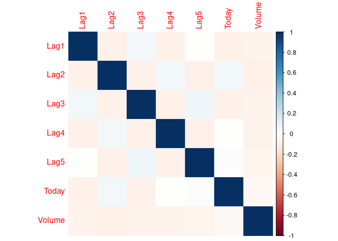
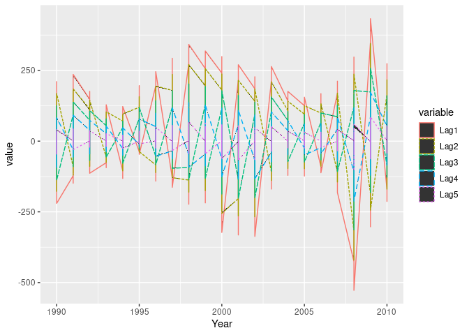

Homework 4
================
Mahmoud Hamza
February 28, 2022

## curse of dimensionality

### 4 (a)

p = 1

fraction = 10%

### (b)

fraction = 1%

### (c)

``` r
(0.1^100) * 100 
```

    ## [1] 1e-98

(1 \* 10^-98) %

### (d)

For every additional parameter in nearest neighbor, the space increases
exponentially. This means that the number of observations, if they
remain constant, would decrease exponentially as well. Thus, with too
many predictors as in c, the number of “near” observations would be too
low. Thus, it would greatly reduce the prediction accuracy.

### (e)

for each scenario, the cube side would be 0.1. However, when p = 1,
there is only 1 side. For p = 2, the area would be 0.01. For p = 100,
the area would be 0.1 \* 100

## 2nd question

``` r
library(ISLR2)

data("Weekly")
```

``` r
summary(Weekly)
```

    ##       Year           Lag1               Lag2               Lag3         
    ##  Min.   :1990   Min.   :-18.1950   Min.   :-18.1950   Min.   :-18.1950  
    ##  1st Qu.:1995   1st Qu.: -1.1540   1st Qu.: -1.1540   1st Qu.: -1.1580  
    ##  Median :2000   Median :  0.2410   Median :  0.2410   Median :  0.2410  
    ##  Mean   :2000   Mean   :  0.1506   Mean   :  0.1511   Mean   :  0.1472  
    ##  3rd Qu.:2005   3rd Qu.:  1.4050   3rd Qu.:  1.4090   3rd Qu.:  1.4090  
    ##  Max.   :2010   Max.   : 12.0260   Max.   : 12.0260   Max.   : 12.0260  
    ##       Lag4               Lag5              Volume            Today         
    ##  Min.   :-18.1950   Min.   :-18.1950   Min.   :0.08747   Min.   :-18.1950  
    ##  1st Qu.: -1.1580   1st Qu.: -1.1660   1st Qu.:0.33202   1st Qu.: -1.1540  
    ##  Median :  0.2380   Median :  0.2340   Median :1.00268   Median :  0.2410  
    ##  Mean   :  0.1458   Mean   :  0.1399   Mean   :1.57462   Mean   :  0.1499  
    ##  3rd Qu.:  1.4090   3rd Qu.:  1.4050   3rd Qu.:2.05373   3rd Qu.:  1.4050  
    ##  Max.   : 12.0260   Max.   : 12.0260   Max.   :9.32821   Max.   : 12.0260  
    ##  Direction 
    ##  Down:484  
    ##  Up  :605  
    ##            
    ##            
    ##            
    ## 

``` r
cor(Weekly[2:8])
```

    ##                Lag1        Lag2        Lag3         Lag4         Lag5
    ## Lag1    1.000000000 -0.07485305  0.05863568 -0.071273876 -0.008183096
    ## Lag2   -0.074853051  1.00000000 -0.07572091  0.058381535 -0.072499482
    ## Lag3    0.058635682 -0.07572091  1.00000000 -0.075395865  0.060657175
    ## Lag4   -0.071273876  0.05838153 -0.07539587  1.000000000 -0.075675027
    ## Lag5   -0.008183096 -0.07249948  0.06065717 -0.075675027  1.000000000
    ## Volume -0.064951313 -0.08551314 -0.06928771 -0.061074617 -0.058517414
    ## Today  -0.075031842  0.05916672 -0.07124364 -0.007825873  0.011012698
    ##             Volume        Today
    ## Lag1   -0.06495131 -0.075031842
    ## Lag2   -0.08551314  0.059166717
    ## Lag3   -0.06928771 -0.071243639
    ## Lag4   -0.06107462 -0.007825873
    ## Lag5   -0.05851741  0.011012698
    ## Volume  1.00000000 -0.033077783
    ## Today  -0.03307778  1.000000000

I can’t find any strong positive or negarive correlations

``` r
library(corrplot)
```

    ## corrplot 0.92 loaded

``` r
corrplot(cor(Weekly[2:8]), method = 'color', order = 'alphabet')
```

<!-- -->

``` r
library(tidyverse)
```

    ## ── Attaching packages ─────────────────────────────────────── tidyverse 1.3.1 ──

    ## ✓ ggplot2 3.3.5     ✓ purrr   0.3.4
    ## ✓ tibble  3.1.6     ✓ dplyr   1.0.7
    ## ✓ tidyr   1.1.4     ✓ stringr 1.4.0
    ## ✓ readr   2.1.1     ✓ forcats 0.5.1

    ## ── Conflicts ────────────────────────────────────────── tidyverse_conflicts() ──
    ## x dplyr::filter() masks stats::filter()
    ## x dplyr::lag()    masks stats::lag()

``` r
df <- Weekly %>%
  select(Year, starts_with('Lag') ) %>%
  gather(key = "variable", value = "value", -Year)


ggplot(df, aes(x = Year, y = value)) + 
  geom_area(aes(color = variable, linetype = variable)) 
```

<!-- -->

## (b)

``` r
model <- (glm(Direction ~ Lag1 + Lag2 +Lag3 +Lag4 +Lag5 + Volume, data = Weekly, family = "binomial"))
summary(model)
```

    ## 
    ## Call:
    ## glm(formula = Direction ~ Lag1 + Lag2 + Lag3 + Lag4 + Lag5 + 
    ##     Volume, family = "binomial", data = Weekly)
    ## 
    ## Deviance Residuals: 
    ##     Min       1Q   Median       3Q      Max  
    ## -1.6949  -1.2565   0.9913   1.0849   1.4579  
    ## 
    ## Coefficients:
    ##             Estimate Std. Error z value Pr(>|z|)   
    ## (Intercept)  0.26686    0.08593   3.106   0.0019 **
    ## Lag1        -0.04127    0.02641  -1.563   0.1181   
    ## Lag2         0.05844    0.02686   2.175   0.0296 * 
    ## Lag3        -0.01606    0.02666  -0.602   0.5469   
    ## Lag4        -0.02779    0.02646  -1.050   0.2937   
    ## Lag5        -0.01447    0.02638  -0.549   0.5833   
    ## Volume      -0.02274    0.03690  -0.616   0.5377   
    ## ---
    ## Signif. codes:  0 '***' 0.001 '**' 0.01 '*' 0.05 '.' 0.1 ' ' 1
    ## 
    ## (Dispersion parameter for binomial family taken to be 1)
    ## 
    ##     Null deviance: 1496.2  on 1088  degrees of freedom
    ## Residual deviance: 1486.4  on 1082  degrees of freedom
    ## AIC: 1500.4
    ## 
    ## Number of Fisher Scoring iterations: 4

Lag2 appears to be statistically significant.

## (c)

``` r
library(regclass)
```

    ## Loading required package: bestglm

    ## Loading required package: leaps

    ## Loading required package: VGAM

    ## Loading required package: stats4

    ## Loading required package: splines

    ## 
    ## Attaching package: 'VGAM'

    ## The following object is masked from 'package:tidyr':
    ## 
    ##     fill

    ## Loading required package: rpart

    ## Loading required package: randomForest

    ## randomForest 4.7-1

    ## Type rfNews() to see new features/changes/bug fixes.

    ## 
    ## Attaching package: 'randomForest'

    ## The following object is masked from 'package:dplyr':
    ## 
    ##     combine

    ## The following object is masked from 'package:ggplot2':
    ## 
    ##     margin

    ## Important regclass change from 1.3:
    ## All functions that had a . in the name now have an _
    ## all.correlations -> all_correlations, cor.demo -> cor_demo, etc.

``` r
confusion_matrix(model) 
```

    ##             Predicted Down Predicted Up Total
    ## Actual Down             54          430   484
    ## Actual Up               48          557   605
    ## Total                  102          987  1089

accuracy = 0.5610652

The majoriy of mistakes made by the logistic regression are related to
stocks that are predicted to be up when in fact they are down.

``` r
train <- Weekly %>% 
  filter(between(Year, 1990, 2008)) 

test <- Weekly %>% 
  filter(Year > 2008)
 
model2 <- glm(Direction ~ Lag2, data = train, family = "binomial")
summary(model2)
```

    ## 
    ## Call:
    ## glm(formula = Direction ~ Lag2, family = "binomial", data = train)
    ## 
    ## Deviance Residuals: 
    ##    Min      1Q  Median      3Q     Max  
    ## -1.536  -1.264   1.021   1.091   1.368  
    ## 
    ## Coefficients:
    ##             Estimate Std. Error z value Pr(>|z|)   
    ## (Intercept)  0.20326    0.06428   3.162  0.00157 **
    ## Lag2         0.05810    0.02870   2.024  0.04298 * 
    ## ---
    ## Signif. codes:  0 '***' 0.001 '**' 0.01 '*' 0.05 '.' 0.1 ' ' 1
    ## 
    ## (Dispersion parameter for binomial family taken to be 1)
    ## 
    ##     Null deviance: 1354.7  on 984  degrees of freedom
    ## Residual deviance: 1350.5  on 983  degrees of freedom
    ## AIC: 1354.5
    ## 
    ## Number of Fisher Scoring iterations: 4

``` r
mod2_conf <- confusion_matrix(model2, test) 
mod2_conf
```

    ##             Predicted Down Predicted Up Total
    ## Actual Down              9           34    43
    ## Actual Up                5           56    61
    ## Total                   14           90   104

``` r
(mod2_conf[1,1] + mod2_conf[2,2] )/ nrow(test)
```

    ## [1] 0.625

accuracy = 0.625

## (e)

``` r
library(MASS)
```

    ## 
    ## Attaching package: 'MASS'

    ## The following object is masked from 'package:dplyr':
    ## 
    ##     select

    ## The following object is masked from 'package:ISLR2':
    ## 
    ##     Boston

``` r
model_lda <- lda(Direction ~ Lag2, data = train)

model_lda
```

    ## Call:
    ## lda(Direction ~ Lag2, data = train)
    ## 
    ## Prior probabilities of groups:
    ##      Down        Up 
    ## 0.4477157 0.5522843 
    ## 
    ## Group means:
    ##             Lag2
    ## Down -0.03568254
    ## Up    0.26036581
    ## 
    ## Coefficients of linear discriminants:
    ##            LD1
    ## Lag2 0.4414162

``` r
lda_conf <- table(predict(model_lda,type="class", newdata = test)$class,test$Direction)

lda_conf
```

    ##       
    ##        Down Up
    ##   Down    9  5
    ##   Up     34 56

``` r
sum(diag(lda_conf))/nrow(test)
```

    ## [1] 0.625

accuracy = \`r sum(diag(lda_conf))/nrow(test)

## (f)

``` r
model_qda <- qda(Direction ~ Lag2, data = train)

model_qda
```

    ## Call:
    ## qda(Direction ~ Lag2, data = train)
    ## 
    ## Prior probabilities of groups:
    ##      Down        Up 
    ## 0.4477157 0.5522843 
    ## 
    ## Group means:
    ##             Lag2
    ## Down -0.03568254
    ## Up    0.26036581

``` r
qda_conf <- table(predict(model_qda,type="class", newdata = test)$class,test$Direction)

qda_conf
```

    ##       
    ##        Down Up
    ##   Down    0  0
    ##   Up     43 61

``` r
sum(diag(qda_conf))/nrow(test)
```

    ## [1] 0.5865385

accuracy = \`r sum(diag(qda_conf))/nrow(test)

## (g)

``` r
library(class)

prediction = knn(data.frame(train$Lag2), data.frame(test$Lag2), train$Direction, k = 1)

knn_conf <- table(prediction, test$Direction)
```

``` r
sum(diag(knn_conf))/nrow(test)
```

    ## [1] 0.5

## (h)

best models: logistic regression and lda They have the highest accuracy.

## (i)

### KNN fine tuning

``` r
knn_acc_list <- rep(NA, 20)
knn_tune <- function(k){
    prediction = knn(data.frame(train$Lag2), data.frame(test$Lag2), train$Direction, k = k)
  
    knn_conf <- table(prediction, test$Direction)

    return(sum(diag(knn_conf))/nrow(test))

}

for (i in 1: 20){
  knn_acc_list[i] <-  knn_tune(i)
} 

max(knn_acc_list)
```

    ## [1] 0.6057692

The maximum accuracy is 0.596, which is still lower than logistic
regression and lda

### adding other predictors variables

``` r
log_tune <- glm(Direction ~ Lag1 + Lag2 +Lag3 +Lag4 +Lag5 , data = train, family = "binomial")
```

``` r
mod_log_tune_conf <- confusion_matrix(log_tune, test) 

mod_log_tune_conf
```

    ##             Predicted Down Predicted Up Total
    ## Actual Down             10           33    43
    ## Actual Up               14           47    61
    ## Total                   24           80   104

``` r
(mod_log_tune_conf[1,1] + mod_log_tune_conf[2,2] )/ nrow(test)
```

    ## [1] 0.5480769

Things are getting worse

### adding interaction terms

``` r
log_tune_int <- glm(Direction ~ Lag1 * Lag2 + Lag2 * Volume , data = train, family = "binomial")
```

``` r
mod_log_tune_int_conf <- confusion_matrix(log_tune_int, test) 

mod_log_tune_int_conf
```

    ##             Predicted Down Predicted Up Total
    ## Actual Down             25           18    43
    ## Actual Up               31           30    61
    ## Total                   56           48   104

``` r
(mod_log_tune_int_conf[1,1] + mod_log_tune_int_conf[2,2] )/ nrow(test)
```

    ## [1] 0.5288462

Again things are getting worse
