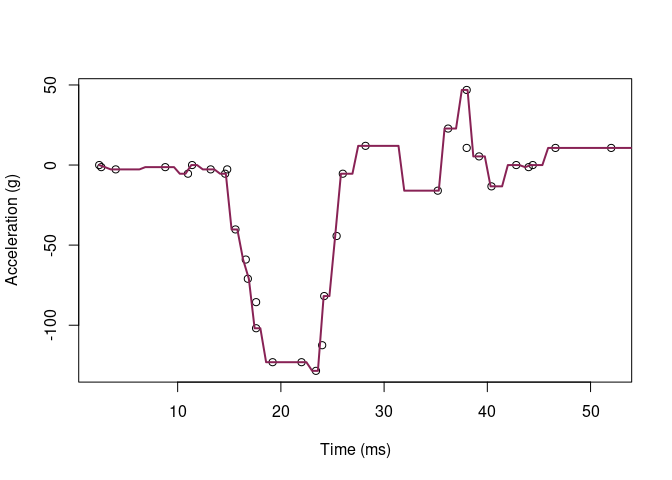
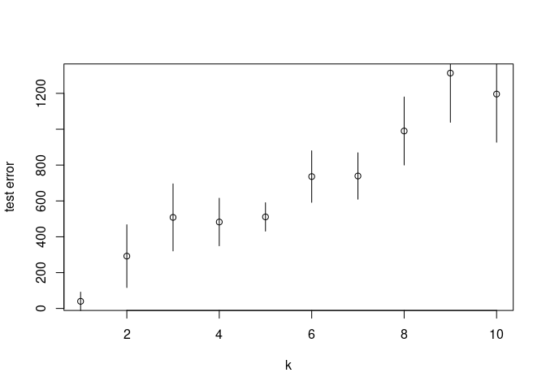

Homework 5
================
Mahmoud Hamza
March 15, 2022

``` r
library('MASS') ## for 'mcycle'
library('manipulate') ## for 'manipulate'
library(gensvm) # for easier train test split
library(tidyverse)
```

    ## ── Attaching packages ─────────────────────────────────────── tidyverse 1.3.1 ──

    ## ✓ ggplot2 3.3.5     ✓ purrr   0.3.4
    ## ✓ tibble  3.1.6     ✓ dplyr   1.0.7
    ## ✓ tidyr   1.1.4     ✓ stringr 1.4.0
    ## ✓ readr   2.1.1     ✓ forcats 0.5.1

    ## ── Conflicts ────────────────────────────────────────── tidyverse_conflicts() ──
    ## x dplyr::filter() masks stats::filter()
    ## x dplyr::lag()    masks stats::lag()
    ## x dplyr::select() masks MASS::select()

# question 1

``` r
y <- mcycle$accel
x <- matrix(mcycle$times, length(mcycle$times), 1)

attach(gensvm.train.test.split(x,y, train.size = 0.75, random.state = 123))

x.train = as.matrix(x.train)
y.train = as.matrix(y.train)

x.valid = as.matrix(x.test)
y.valid = as.matrix(y.test)

plot(x.train, y.train, xlab="Time (ms)", ylab="Acceleration (g)")
```

<!-- -->

``` r
## Epanechnikov kernel function
## x  - n x p matrix of training inputs
## x0 - 1 x p input where to make prediction
## lambda - bandwidth (neighborhood size)
kernel_epanechnikov <- function(x, x0, lambda=1) {
  d <- function(t)
    ifelse(t <= 1, 3/4*(1-t^2), 0)
  z <- t(t(x) - x0)
  d(sqrt(rowSums(z*z))/lambda)
}

## k-NN kernel function
## x  - n x p matrix of training inputs
## x0 - 1 x p input where to make prediction
## k  - number of nearest neighbors
kernel_k_nearest_neighbors <- function(x, x0, k=1) {
  ## compute distance betwen each x and x0
  z <- t(t(x) - x0)
  d <- sqrt(rowSums(z*z))

  ## initialize kernel weights to zero
  w <- rep(0, length(d))
  
  ## set weight to 1 for k nearest neighbors
  w[order(d)[1:k]] <- 1
  
  return(w)
}

## Make predictions using the NW method
## y  - n x 1 vector of training outputs
## x  - n x p matrix of training inputs
## x0 - m x p matrix where to make predictions
## kern  - kernel function to use
## ... - arguments to pass to kernel function
nadaraya_watson <- function(y, x, x0, kern, ...) {
  k <- t(apply(x0, 1, function(x0_) {
    k_ <- kern(x, x0_, ...)
    k_/sum(k_)
  }))
  yhat <- drop(k %*% y)
  attr(yhat, 'k') <- k
  return(yhat)
}

## Helper function to view kernel (smoother) matrix
matrix_image <- function(x) {
  rot <- function(x) t(apply(x, 2, rev))
  cls <- rev(gray.colors(20, end=1))
  image(rot(x), col=cls, axes=FALSE)
  xlb <- pretty(1:ncol(x))
  xat <- (xlb-0.5)/ncol(x)
  ylb <- pretty(1:nrow(x))
  yat <- (ylb-0.5)/nrow(x)
  axis(3, at=xat, labels=xlb)
  axis(2, at=yat, labels=ylb)
  mtext('Rows', 2, 3)
  mtext('Columns', 3, 3)
}

## Compute effective df using NW method
## y  - n x 1 vector of training outputs
## x  - n x p matrix of training inputs
## kern  - kernel function to use
## ... - arguments to pass to kernel function
effective_df <- function(y, x, kern, ...) {
  y_hat <- nadaraya_watson(y, x, x,
    kern=kern, ...)
  sum(diag(attr(y_hat, 'k')))
}

## loss function
## y    - train/test y
## yhat - predictions at train/test x
loss_squared_error <- function(y, yhat)
  return((y - yhat)^2)

## test/train error
## y    - train/test y
## yhat - predictions at train/test x
## loss - loss function
error <- function(y, yhat, loss=loss_squared_error)
  return(mean(loss(y, yhat)))

## AIC
## y    - training y
## yhat - predictions at training x
## d    - effective degrees of freedom
aic <- function(y, yhat, d)
  return(error(y, yhat) + 2/length(y)*d)

## BIC
## y    - training y
## yhat - predictions at training x
## d    - effective degrees of freedom
bic <- function(y, yhat, d)
  return(error(y, yhat) + log(length(y))/length(y)*d)


## make predictions using NW method at training inputs
y_hat <- nadaraya_watson(y.train, x.train, x.train,
  kernel_epanechnikov, lambda=5)

## view kernel (smoother) matrix
matrix_image(attr(y_hat, 'k'))
```

<!-- -->

``` r
## compute effective degrees of freedom

edf <- effective_df(y.train, x.train, kernel_epanechnikov, lambda=5)
aic(y.train, y_hat, edf)
```

    ## [1] 722.7298

``` r
bic(y.train, y_hat, edf)
```

    ## [1] 722.9516

``` r
## create a grid of inputs 
x_plot <- matrix(seq(min(x.train),max(x.train),length.out=100),100,1)

## make predictions using NW method at each of grid points
y_hat_plot <- nadaraya_watson(y.train, x.train, x_plot,
  kernel_epanechnikov, lambda=1)

## plot predictions
plot(x.train, y.train, xlab="Time (ms)", ylab="Acceleration (g)")
lines(x_plot, y_hat_plot, col="#882255", lwd=2) 
```

<!-- -->

``` r
## how does k affect shape of predictor and eff. df using k-nn kernel ?
```

``` r
# manipulate({
#   ## make predictions using NW method at training inputs
#   y_hat <- nadaraya_watson(y, x, x,
#     kern=kernel_k_nearest_neighbors, k=k_slider)
#   edf <- effective_df(y, x,
#     kern=kernel_k_nearest_neighbors, k=k_slider)
#   aic_ <- aic(y, y_hat, edf)
#   bic_ <- bic(y, y_hat, edf)
#   y_hat_plot <- nadaraya_watson(y, x, x_plot,
#     kern=kernel_k_nearest_neighbors, k=k_slider)
#   plot(x, y, xlab="Time (ms)", ylab="Acceleration (g)")
#   legend('topright', legend = c(
#     paste0('eff. df = ', round(edf,1)),
#     paste0('aic = ', round(aic_, 1)),
#     paste0('bic = ', round(bic_, 1))),
#     bty='n')
#   lines(x_plot, y_hat_plot, col="#882255", lwd=2)
# }, k_slider=slider(1, 10, initial=3, step=1))
```

``` r
## create a grid of inputs 
x_plot <- matrix(seq(min(x),max(x),length.out=100),100,1)

## make predictions using NW method at each of grid points
y_hat_plot <- nadaraya_watson(y.valid, x.valid, x_plot,
  kernel_epanechnikov, lambda=1)

## plot predictions
plot(x.valid, y.valid, xlab="Time (ms)", ylab="Acceleration (g)")
lines(x_plot, y_hat_plot, col="#882255", lwd=2) 
```

<!-- -->

``` r
## how does k affect shape of predictor and eff. df using k-nn kernel ?
# manipulate({
#   ## make predictions using NW method at training inputs
#   y_hat <- nadaraya_watson(y, x, x,
#     kern=kernel_k_nearest_neighbors, k=k_slider)
#   edf <- effective_df(y, x,
#     kern=kernel_k_nearest_neighbors, k=k_slider)
#   aic_ <- aic(y, y_hat, edf)
#   bic_ <- bic(y, y_hat, edf)
#   y_hat_plot <- nadaraya_watson(y, x, x_plot,
#     kern=kernel_k_nearest_neighbors, k=k_slider)
#   plot(x, y, xlab="Time (ms)", ylab="Acceleration (g)")
#   legend('topright', legend = c(
#     paste0('eff. df = ', round(edf,1)),
#     paste0('aic = ', round(aic_, 1)),
#     paste0('bic = ', round(bic_, 1))),
#     bty='n')
#   lines(x_plot, y_hat_plot, col="#882255", lwd=2)
# }, k_slider=slider(1, 10, initial=3, step=1))
```

## 5 fold cross validation

``` r
library(modelr)
cv  <- crossv_kfold(mcycle, k = 5)
cv
```

    ## # A tibble: 5 × 3
    ##   train                test                .id  
    ##   <named list>         <named list>        <chr>
    ## 1 <resample [106 x 2]> <resample [27 x 2]> 1    
    ## 2 <resample [106 x 2]> <resample [27 x 2]> 2    
    ## 3 <resample [106 x 2]> <resample [27 x 2]> 3    
    ## 4 <resample [107 x 2]> <resample [26 x 2]> 4    
    ## 5 <resample [107 x 2]> <resample [26 x 2]> 5

``` r
for (i in 1:10){
  for(j in 1:5){
    split <- sample(1:nrow(mcycle), round(0.8*nrow(mcycle)))
    train.data <- mcycle[split,]
    valid.data <- mcycle[-split,]
    
    y_hat <- nadaraya_watson(as.matrix(valid.data[,2]), as.matrix(valid.data[,1]),  as.matrix(valid.data[,1]), kernel_epanechnikov, lambda=i)
    
    print('#########')
    print(i)
    print(error(valid.data[,2], y_hat))
}

  }
```

    ## [1] "#########"
    ## [1] 1
    ## [1] 436.0937
    ## [1] "#########"
    ## [1] 1
    ## [1] 75.47204
    ## [1] "#########"
    ## [1] 1
    ## [1] 178.9131
    ## [1] "#########"
    ## [1] 1
    ## [1] 618.947
    ## [1] "#########"
    ## [1] 1
    ## [1] 131.2691
    ## [1] "#########"
    ## [1] 2
    ## [1] 380.3627
    ## [1] "#########"
    ## [1] 2
    ## [1] 73.25363
    ## [1] "#########"
    ## [1] 2
    ## [1] 324.9156
    ## [1] "#########"
    ## [1] 2
    ## [1] 279.8591
    ## [1] "#########"
    ## [1] 2
    ## [1] 536.2545
    ## [1] "#########"
    ## [1] 3
    ## [1] 387.0194
    ## [1] "#########"
    ## [1] 3
    ## [1] 542.4166
    ## [1] "#########"
    ## [1] 3
    ## [1] 234.5985
    ## [1] "#########"
    ## [1] 3
    ## [1] 333.4148
    ## [1] "#########"
    ## [1] 3
    ## [1] 353.6704
    ## [1] "#########"
    ## [1] 4
    ## [1] 837.8805
    ## [1] "#########"
    ## [1] 4
    ## [1] 977.5619
    ## [1] "#########"
    ## [1] 4
    ## [1] 333.8376
    ## [1] "#########"
    ## [1] 4
    ## [1] 330.4068
    ## [1] "#########"
    ## [1] 4
    ## [1] 434.4579
    ## [1] "#########"
    ## [1] 5
    ## [1] 322.6934
    ## [1] "#########"
    ## [1] 5
    ## [1] 666.0306
    ## [1] "#########"
    ## [1] 5
    ## [1] 493.6477
    ## [1] "#########"
    ## [1] 5
    ## [1] 885.7497
    ## [1] "#########"
    ## [1] 5
    ## [1] 510.2828
    ## [1] "#########"
    ## [1] 6
    ## [1] 499.2506
    ## [1] "#########"
    ## [1] 6
    ## [1] 459.8478
    ## [1] "#########"
    ## [1] 6
    ## [1] 894.6685
    ## [1] "#########"
    ## [1] 6
    ## [1] 857.9599
    ## [1] "#########"
    ## [1] 6
    ## [1] 749.7656
    ## [1] "#########"
    ## [1] 7
    ## [1] 777.4861
    ## [1] "#########"
    ## [1] 7
    ## [1] 753.2269
    ## [1] "#########"
    ## [1] 7
    ## [1] 627.3463
    ## [1] "#########"
    ## [1] 7
    ## [1] 728.6257
    ## [1] "#########"
    ## [1] 7
    ## [1] 736.9522
    ## [1] "#########"
    ## [1] 8
    ## [1] 621.2363
    ## [1] "#########"
    ## [1] 8
    ## [1] 872.4283
    ## [1] "#########"
    ## [1] 8
    ## [1] 753.1904
    ## [1] "#########"
    ## [1] 8
    ## [1] 524.7432
    ## [1] "#########"
    ## [1] 8
    ## [1] 901.1036
    ## [1] "#########"
    ## [1] 9
    ## [1] 944.315
    ## [1] "#########"
    ## [1] 9
    ## [1] 554.8613
    ## [1] "#########"
    ## [1] 9
    ## [1] 959.5624
    ## [1] "#########"
    ## [1] 9
    ## [1] 1257.717
    ## [1] "#########"
    ## [1] 9
    ## [1] 955.8946
    ## [1] "#########"
    ## [1] 10
    ## [1] 906.5236
    ## [1] "#########"
    ## [1] 10
    ## [1] 1205.998
    ## [1] "#########"
    ## [1] 10
    ## [1] 939.9653
    ## [1] "#########"
    ## [1] 10
    ## [1] 1205.712
    ## [1] "#########"
    ## [1] 10
    ## [1] 576.719

## get the average cross validation

``` r
for (i in 1:10){
  for(j in 1:5){
    split <- sample(1:nrow(mcycle), round(0.8*nrow(mcycle)))
    train.data <- mcycle[split,]
    valid.data <- mcycle[-split,]
    
    y_hat <- nadaraya_watson(as.matrix(valid.data[,2]), as.matrix(valid.data[,1]),  as.matrix(valid.data[,1]), kernel_epanechnikov, lambda=i)
    
    print('#########')
    print(i)
    print(error(valid.data[,2], y_hat))
}

  }
```

    ## [1] "#########"
    ## [1] 1
    ## [1] 264.6262
    ## [1] "#########"
    ## [1] 1
    ## [1] 112.2512
    ## [1] "#########"
    ## [1] 1
    ## [1] 149.2676
    ## [1] "#########"
    ## [1] 1
    ## [1] 115.2357
    ## [1] "#########"
    ## [1] 1
    ## [1] 211.1102
    ## [1] "#########"
    ## [1] 2
    ## [1] 354.8774
    ## [1] "#########"
    ## [1] 2
    ## [1] 477.0806
    ## [1] "#########"
    ## [1] 2
    ## [1] 320.2585
    ## [1] "#########"
    ## [1] 2
    ## [1] 246.8342
    ## [1] "#########"
    ## [1] 2
    ## [1] 288.5778
    ## [1] "#########"
    ## [1] 3
    ## [1] 427.7859
    ## [1] "#########"
    ## [1] 3
    ## [1] 339.711
    ## [1] "#########"
    ## [1] 3
    ## [1] 496.9787
    ## [1] "#########"
    ## [1] 3
    ## [1] 413.3043
    ## [1] "#########"
    ## [1] 3
    ## [1] 502.3256
    ## [1] "#########"
    ## [1] 4
    ## [1] 380.7455
    ## [1] "#########"
    ## [1] 4
    ## [1] 384.1816
    ## [1] "#########"
    ## [1] 4
    ## [1] 613.174
    ## [1] "#########"
    ## [1] 4
    ## [1] 225.867
    ## [1] "#########"
    ## [1] 4
    ## [1] 494.8786
    ## [1] "#########"
    ## [1] 5
    ## [1] 610.7974
    ## [1] "#########"
    ## [1] 5
    ## [1] 427.9395
    ## [1] "#########"
    ## [1] 5
    ## [1] 476.1737
    ## [1] "#########"
    ## [1] 5
    ## [1] 578.942
    ## [1] "#########"
    ## [1] 5
    ## [1] 408.554
    ## [1] "#########"
    ## [1] 6
    ## [1] 734.463
    ## [1] "#########"
    ## [1] 6
    ## [1] 517.6432
    ## [1] "#########"
    ## [1] 6
    ## [1] 746.3629
    ## [1] "#########"
    ## [1] 6
    ## [1] 669.2796
    ## [1] "#########"
    ## [1] 6
    ## [1] 828.7347
    ## [1] "#########"
    ## [1] 7
    ## [1] 827.9074
    ## [1] "#########"
    ## [1] 7
    ## [1] 1074.156
    ## [1] "#########"
    ## [1] 7
    ## [1] 830.1885
    ## [1] "#########"
    ## [1] 7
    ## [1] 892.2546
    ## [1] "#########"
    ## [1] 7
    ## [1] 620.0129
    ## [1] "#########"
    ## [1] 8
    ## [1] 616.5266
    ## [1] "#########"
    ## [1] 8
    ## [1] 834.6063
    ## [1] "#########"
    ## [1] 8
    ## [1] 508.9906
    ## [1] "#########"
    ## [1] 8
    ## [1] 761.9175
    ## [1] "#########"
    ## [1] 8
    ## [1] 858.6745
    ## [1] "#########"
    ## [1] 9
    ## [1] 961.3421
    ## [1] "#########"
    ## [1] 9
    ## [1] 994.1187
    ## [1] "#########"
    ## [1] 9
    ## [1] 829.4172
    ## [1] "#########"
    ## [1] 9
    ## [1] 983.317
    ## [1] "#########"
    ## [1] 9
    ## [1] 615.4812
    ## [1] "#########"
    ## [1] 10
    ## [1] 1161.125
    ## [1] "#########"
    ## [1] 10
    ## [1] 958.8413
    ## [1] "#########"
    ## [1] 10
    ## [1] 895.9746
    ## [1] "#########"
    ## [1] 10
    ## [1] 796.4484
    ## [1] "#########"
    ## [1] 10
    ## [1] 1033.991

# plot the averages based on cross validation

``` r
plot_cross <- function(){
  
std_dev <- rep(NA, 10)
av <- rep(NA, 5)
final_list <- rep(NA, 10)

for (i in 1:10){
  for(j in 1:5){
    split <- sample(1:nrow(mcycle), round(0.8*nrow(mcycle)))
    train.data <- mcycle[split,]
    valid.data <- mcycle[-split,]
    
    y_hat <- nadaraya_watson(as.matrix(valid.data[,2]), as.matrix(valid.data[,1]),  as.matrix(valid.data[,1]), kernel_epanechnikov, lambda=i)
    
    # print('#########')
    # print(i)
    # print(error(valid.data[,2], y_hat))
    
    av[j] <- error(valid.data[,2], y_hat)
    final_list[i] <- mean(av)
    std_dev[i] <- sd(av)
    
    
}

  }
  x_plot <- seq(1,10,1)
  plot(x_plot, final_list, ylab = 'test error', xlab = 'lamdba')
  for (i in 1:10){
  segments(x_plot[i], final_list[i] - std_dev[i], y1 = final_list[i] + std_dev[i])
  }
}

plot_cross()
```

<!-- -->

I would go for lambda = 1 However, I know I am doing something wrong but
I can’t realize what is it.
