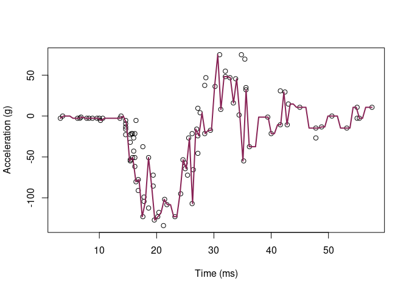

Homework 5
================
Mahmoud Hamza
March 15, 2022

``` r
library('MASS') ## for 'mcycle'
library('manipulate') ## for 'manipulate'
library(gensvm) # for easier train test split
library(tidyverse)
```

    ## ── Attaching packages ─────────────────────────────────────── tidyverse 1.3.1 ──

    ## ✓ ggplot2 3.3.5     ✓ purrr   0.3.4
    ## ✓ tibble  3.1.6     ✓ dplyr   1.0.8
    ## ✓ tidyr   1.2.0     ✓ stringr 1.4.0
    ## ✓ readr   2.1.2     ✓ forcats 0.5.1

    ## ── Conflicts ────────────────────────────────────────── tidyverse_conflicts() ──
    ## x dplyr::filter() masks stats::filter()
    ## x dplyr::lag()    masks stats::lag()
    ## x dplyr::select() masks MASS::select()

# question 1

``` r
y <- mcycle$accel
x <- matrix(mcycle$times, length(mcycle$times), 1)

attach(gensvm.train.test.split(x,y, train.size = 0.75, random.state = 123))

x.train = as.matrix(x.train)
y.train = as.matrix(y.train)

x.valid = as.matrix(x.test)
y.valid = as.matrix(y.test)

plot(x.train, y.train, xlab="Time (ms)", ylab="Acceleration (g)")
```

<!-- -->

``` r
## Epanechnikov kernel function
## x  - n x p matrix of training inputs
## x0 - 1 x p input where to make prediction
## lambda - bandwidth (neighborhood size)
kernel_epanechnikov <- function(x, x0, lambda=1) {
  d <- function(t)
    ifelse(t <= 1, 3/4*(1-t^2), 0)
  z <- t(t(x) - x0)
  d(sqrt(rowSums(z*z))/lambda)
}

## k-NN kernel function
## x  - n x p matrix of training inputs
## x0 - 1 x p input where to make prediction
## k  - number of nearest neighbors
kernel_k_nearest_neighbors <- function(x, x0, k=1) {
  ## compute distance between each x and x0
  z <- t(t(x) - x0)
  d <- sqrt(rowSums(z*z))

  ## initialize kernel weights to zero
  w <- rep(0, length(d))
  
  ## set weight to 1 for k nearest neighbors
  w[order(d)[1:k]] <- 1
  
  return(w)
}

## Make predictions using the NW method
## y  - n x 1 vector of training outputs
## x  - n x p matrix of training inputs
## x0 - m x p matrix where to make predictions
## kern  - kernel function to use
## ... - arguments to pass to kernel function
nadaraya_watson <- function(y, x, x0, kern, ...) {
  k <- t(apply(x0, 1, function(x0_) {
    k_ <- kern(x, x0_, ...)
    k_/sum(k_)
  }))
  yhat <- drop(k %*% y)
  attr(yhat, 'k') <- k
  return(yhat)
}

## Helper function to view kernel (smoother) matrix
matrix_image <- function(x) {
  rot <- function(x) t(apply(x, 2, rev))
  cls <- rev(gray.colors(20, end=1))
  image(rot(x), col=cls, axes=FALSE)
  xlb <- pretty(1:ncol(x))
  xat <- (xlb-0.5)/ncol(x)
  ylb <- pretty(1:nrow(x))
  yat <- (ylb-0.5)/nrow(x)
  axis(3, at=xat, labels=xlb)
  axis(2, at=yat, labels=ylb)
  mtext('Rows', 2, 3)
  mtext('Columns', 3, 3)
}

## Compute effective df using NW method
## y  - n x 1 vector of training outputs
## x  - n x p matrix of training inputs
## kern  - kernel function to use
## ... - arguments to pass to kernel function
effective_df <- function(y, x, kern, ...) {
  y_hat <- nadaraya_watson(y, x, x,
    kern=kern, ...)
  sum(diag(attr(y_hat, 'k')))
}

## loss function
## y    - train/test y
## yhat - predictions at train/test x
loss_squared_error <- function(y, yhat)
  return((y - yhat)^2)

## test/train error
## y    - train/test y
## yhat - predictions at train/test x
## loss - loss function
error <- function(y, yhat, loss=loss_squared_error)
  return(mean(loss(y, yhat)))

## AIC
## y    - training y
## yhat - predictions at training x
## d    - effective degrees of freedom
aic <- function(y, yhat, d)
  return(error(y, yhat) + 2/length(y)*d)

## BIC
## y    - training y
## yhat - predictions at training x
## d    - effective degrees of freedom
bic <- function(y, yhat, d)
  return(error(y, yhat) + log(length(y))/length(y)*d)


## make predictions using NW method at training inputs
y_hat <- nadaraya_watson(y.train, x.train, x.train,
  kern = kernel_k_nearest_neighbors, k=5)

## view kernel (smoother) matrix
matrix_image(attr(y_hat, 'k'))
```

<!-- -->

``` r
## compute effective degrees of freedom

edf <- effective_df(y.train, x.train, kern = kernel_k_nearest_neighbors, k=5)
aic(y.train, y_hat, edf)
```

    ## [1] 503.1019

``` r
bic(y.train, y_hat, edf)
```

    ## [1] 503.6229

``` r
## create a grid of inputs 
x_plot <- matrix(seq(min(x.train),max(x.train),length.out=100),100,1)

## make predictions using NW method at each of grid points
y_hat_plot <- nadaraya_watson(y.train, x.train, x_plot,
  kern = kernel_k_nearest_neighbors, k=1)

## plot predictions
plot(x.train, y.train, xlab="Time (ms)", ylab="Acceleration (g)")
lines(x_plot, y_hat_plot, col="#882255", lwd=2) 
```

<!-- -->

``` r
## how does k affect shape of predictor and eff. df using k-nn kernel ?
```

``` r
# manipulate({
#   ## make predictions using NW method at training inputs
#   y_hat <- nadaraya_watson(y, x, x,
#     kern=kernel_k_nearest_neighbors, k=k_slider)
#   edf <- effective_df(y, x,
#     kern=kernel_k_nearest_neighbors, k=k_slider)
#   aic_ <- aic(y, y_hat, edf)
#   bic_ <- bic(y, y_hat, edf)
#   y_hat_plot <- nadaraya_watson(y, x, x_plot,
#     kern=kernel_k_nearest_neighbors, k=k_slider)
#   plot(x, y, xlab="Time (ms)", ylab="Acceleration (g)")
#   legend('topright', legend = c(
#     paste0('eff. df = ', round(edf,1)),
#     paste0('aic = ', round(aic_, 1)),
#     paste0('bic = ', round(bic_, 1))),
#     bty='n')
#   lines(x_plot, y_hat_plot, col="#882255", lwd=2)
# }, k_slider=slider(1, 10, initial=3, step=1))
```

``` r
## create a grid of inputs 
x_plot <- matrix(seq(min(x),max(x),length.out=100),100,1)

## make predictions using NW method at each of grid points
y_hat_plot <- nadaraya_watson(y.valid, x.valid, x_plot,
  kern = kernel_k_nearest_neighbors, k=1)

## plot predictions
plot(x.valid, y.valid, xlab="Time (ms)", ylab="Acceleration (g)")
lines(x_plot, y_hat_plot, col="#882255", lwd=2) 
```

<!-- -->

``` r
## how does k affect shape of predictor and eff. df using k-nn kernel ?
# manipulate({
#   ## make predictions using NW method at training inputs
#   y_hat <- nadaraya_watson(y, x, x,
#     kern=kernel_k_nearest_neighbors, k=k_slider)
#   edf <- effective_df(y, x,
#     kern=kernel_k_nearest_neighbors, k=k_slider)
#   aic_ <- aic(y, y_hat, edf)
#   bic_ <- bic(y, y_hat, edf)
#   y_hat_plot <- nadaraya_watson(y, x, x_plot,
#     kern=kernel_k_nearest_neighbors, k=k_slider)
#   plot(x, y, xlab="Time (ms)", ylab="Acceleration (g)")
#   legend('topright', legend = c(
#     paste0('eff. df = ', round(edf,1)),
#     paste0('aic = ', round(aic_, 1)),
#     paste0('bic = ', round(bic_, 1))),
#     bty='n')
#   lines(x_plot, y_hat_plot, col="#882255", lwd=2)
# }, k_slider=slider(1, 10, initial=3, step=1))
```

## 5 fold cross validation

``` r
library(modelr)
cv  <- crossv_kfold(mcycle, k = 5)
cv
```

    ## # A tibble: 5 × 3
    ##   train                test                .id  
    ##   <named list>         <named list>        <chr>
    ## 1 <resample [106 x 2]> <resample [27 x 2]> 1    
    ## 2 <resample [106 x 2]> <resample [27 x 2]> 2    
    ## 3 <resample [106 x 2]> <resample [27 x 2]> 3    
    ## 4 <resample [107 x 2]> <resample [26 x 2]> 4    
    ## 5 <resample [107 x 2]> <resample [26 x 2]> 5

``` r
for (i in 1:10){
  for(j in 1:5){
    split <- sample(1:nrow(mcycle), round(0.8*nrow(mcycle)))
    train.data <- mcycle[split,]
    valid.data <- mcycle[-split,]
    
    y_hat <- nadaraya_watson(as.matrix(valid.data[,2]), as.matrix(valid.data[,1]),  as.matrix(valid.data[,1]), kern = kernel_k_nearest_neighbors, k=i)
    
    print('#########')
    print(i)
    print(error(valid.data[,2], y_hat))
}

  }
```

    ## [1] "#########"
    ## [1] 1
    ## [1] 100.7596
    ## [1] "#########"
    ## [1] 1
    ## [1] 6.65037
    ## [1] "#########"
    ## [1] 1
    ## [1] 73.0063
    ## [1] "#########"
    ## [1] 1
    ## [1] 369.5878
    ## [1] "#########"
    ## [1] 1
    ## [1] 176.4596
    ## [1] "#########"
    ## [1] 2
    ## [1] 366.9483
    ## [1] "#########"
    ## [1] 2
    ## [1] 115.8885
    ## [1] "#########"
    ## [1] 2
    ## [1] 234.524
    ## [1] "#########"
    ## [1] 2
    ## [1] 227.7595
    ## [1] "#########"
    ## [1] 2
    ## [1] 588.3835
    ## [1] "#########"
    ## [1] 3
    ## [1] 661.6932
    ## [1] "#########"
    ## [1] 3
    ## [1] 644.8007
    ## [1] "#########"
    ## [1] 3
    ## [1] 417.1798
    ## [1] "#########"
    ## [1] 3
    ## [1] 350.0453
    ## [1] "#########"
    ## [1] 3
    ## [1] 254.9475
    ## [1] "#########"
    ## [1] 4
    ## [1] 853.9351
    ## [1] "#########"
    ## [1] 4
    ## [1] 980.3254
    ## [1] "#########"
    ## [1] 4
    ## [1] 349.1042
    ## [1] "#########"
    ## [1] 4
    ## [1] 457.1037
    ## [1] "#########"
    ## [1] 4
    ## [1] 434.6271
    ## [1] "#########"
    ## [1] 5
    ## [1] 427.465
    ## [1] "#########"
    ## [1] 5
    ## [1] 785.394
    ## [1] "#########"
    ## [1] 5
    ## [1] 532.1966
    ## [1] "#########"
    ## [1] 5
    ## [1] 723.9049
    ## [1] "#########"
    ## [1] 5
    ## [1] 545.4655
    ## [1] "#########"
    ## [1] 6
    ## [1] 803.918
    ## [1] "#########"
    ## [1] 6
    ## [1] 527.9955
    ## [1] "#########"
    ## [1] 6
    ## [1] 772.0556
    ## [1] "#########"
    ## [1] 6
    ## [1] 820.9087
    ## [1] "#########"
    ## [1] 6
    ## [1] 754.353
    ## [1] "#########"
    ## [1] 7
    ## [1] 778.7652
    ## [1] "#########"
    ## [1] 7
    ## [1] 748.7285
    ## [1] "#########"
    ## [1] 7
    ## [1] 665.9767
    ## [1] "#########"
    ## [1] 7
    ## [1] 625.7171
    ## [1] "#########"
    ## [1] 7
    ## [1] 915.9417
    ## [1] "#########"
    ## [1] 8
    ## [1] 1106.667
    ## [1] "#########"
    ## [1] 8
    ## [1] 863.1016
    ## [1] "#########"
    ## [1] 8
    ## [1] 1131.115
    ## [1] "#########"
    ## [1] 8
    ## [1] 596.3671
    ## [1] "#########"
    ## [1] 8
    ## [1] 903.9852
    ## [1] "#########"
    ## [1] 9
    ## [1] 969.0748
    ## [1] "#########"
    ## [1] 9
    ## [1] 730.4271
    ## [1] "#########"
    ## [1] 9
    ## [1] 1133.768
    ## [1] "#########"
    ## [1] 9
    ## [1] 1117.108
    ## [1] "#########"
    ## [1] 9
    ## [1] 871.4282
    ## [1] "#########"
    ## [1] 10
    ## [1] 943.5531
    ## [1] "#########"
    ## [1] 10
    ## [1] 1364.067
    ## [1] "#########"
    ## [1] 10
    ## [1] 961.5572
    ## [1] "#########"
    ## [1] 10
    ## [1] 1254.256
    ## [1] "#########"
    ## [1] 10
    ## [1] 607.7473

## get the average cross validation

``` r
for (i in 1:10){
  for(j in 1:5){
    split <- sample(1:nrow(mcycle), round(0.8*nrow(mcycle)))
    train.data <- mcycle[split,]
    valid.data <- mcycle[-split,]
    
    y_hat <- nadaraya_watson(as.matrix(valid.data[,2]), as.matrix(valid.data[,1]),  as.matrix(valid.data[,1]), kern = kernel_k_nearest_neighbors, k=i)
    
    print('#########')
    print(i)
    print(error(valid.data[,2], y_hat))
}

  }
```

    ## [1] "#########"
    ## [1] 1
    ## [1] 273.783
    ## [1] "#########"
    ## [1] 1
    ## [1] 0
    ## [1] "#########"
    ## [1] 1
    ## [1] 6.65037
    ## [1] "#########"
    ## [1] 1
    ## [1] 86.79444
    ## [1] "#########"
    ## [1] 1
    ## [1] 34.90704
    ## [1] "#########"
    ## [1] 2
    ## [1] 210.573
    ## [1] "#########"
    ## [1] 2
    ## [1] 383.9313
    ## [1] "#########"
    ## [1] 2
    ## [1] 245.6607
    ## [1] "#########"
    ## [1] 2
    ## [1] 255.5145
    ## [1] "#########"
    ## [1] 2
    ## [1] 244.8646
    ## [1] "#########"
    ## [1] 3
    ## [1] 566.9708
    ## [1] "#########"
    ## [1] 3
    ## [1] 365.5426
    ## [1] "#########"
    ## [1] 3
    ## [1] 460.9816
    ## [1] "#########"
    ## [1] 3
    ## [1] 519.4794
    ## [1] "#########"
    ## [1] 3
    ## [1] 617.2986
    ## [1] "#########"
    ## [1] 4
    ## [1] 548.9586
    ## [1] "#########"
    ## [1] 4
    ## [1] 465.1045
    ## [1] "#########"
    ## [1] 4
    ## [1] 423.8153
    ## [1] "#########"
    ## [1] 4
    ## [1] 200.521
    ## [1] "#########"
    ## [1] 4
    ## [1] 649.0339
    ## [1] "#########"
    ## [1] 5
    ## [1] 555.2351
    ## [1] "#########"
    ## [1] 5
    ## [1] 474.3539
    ## [1] "#########"
    ## [1] 5
    ## [1] 444.2204
    ## [1] "#########"
    ## [1] 5
    ## [1] 487.827
    ## [1] "#########"
    ## [1] 5
    ## [1] 346.4241
    ## [1] "#########"
    ## [1] 6
    ## [1] 648.0077
    ## [1] "#########"
    ## [1] 6
    ## [1] 738.7517
    ## [1] "#########"
    ## [1] 6
    ## [1] 607.0483
    ## [1] "#########"
    ## [1] 6
    ## [1] 731.3581
    ## [1] "#########"
    ## [1] 6
    ## [1] 675.057
    ## [1] "#########"
    ## [1] 7
    ## [1] 710.8437
    ## [1] "#########"
    ## [1] 7
    ## [1] 907.1983
    ## [1] "#########"
    ## [1] 7
    ## [1] 1065.535
    ## [1] "#########"
    ## [1] 7
    ## [1] 937.4267
    ## [1] "#########"
    ## [1] 7
    ## [1] 567.3189
    ## [1] "#########"
    ## [1] 8
    ## [1] 1088.841
    ## [1] "#########"
    ## [1] 8
    ## [1] 1006.396
    ## [1] "#########"
    ## [1] 8
    ## [1] 564.279
    ## [1] "#########"
    ## [1] 8
    ## [1] 727.949
    ## [1] "#########"
    ## [1] 8
    ## [1] 849.6781
    ## [1] "#########"
    ## [1] 9
    ## [1] 870.3981
    ## [1] "#########"
    ## [1] 9
    ## [1] 1021.281
    ## [1] "#########"
    ## [1] 9
    ## [1] 1207.565
    ## [1] "#########"
    ## [1] 9
    ## [1] 875.0195
    ## [1] "#########"
    ## [1] 9
    ## [1] 622.5646
    ## [1] "#########"
    ## [1] 10
    ## [1] 1350.422
    ## [1] "#########"
    ## [1] 10
    ## [1] 971.8571
    ## [1] "#########"
    ## [1] 10
    ## [1] 1431.452
    ## [1] "#########"
    ## [1] 10
    ## [1] 907.5056
    ## [1] "#########"
    ## [1] 10
    ## [1] 985.3504

# plot the averages based on cross validation

``` r
plot_cross <- function(){
  
std_dev <- rep(NA, 10)
av <- rep(NA, 5)
final_list <- rep(NA, 10)

for (i in 1:10){
  for(j in 1:5){
    split <- sample(1:nrow(mcycle), round(0.8*nrow(mcycle)))
    train.data <- mcycle[split,]
    valid.data <- mcycle[-split,]
    
    y_hat <- nadaraya_watson(as.matrix(valid.data[,2]), as.matrix(valid.data[,1]),  as.matrix(valid.data[,1]), kern = kernel_k_nearest_neighbors, k=i)
    
    # print('#########')
    # print(i)
    # print(error(valid.data[,2], y_hat))
    
    av[j] <- error(valid.data[,2], y_hat)
    final_list[i] <- mean(av)
    std_dev[i] <- sd(av)
    
    
}

  }
  x_plot <- seq(1,10,1)
  plot(x_plot, final_list, ylab = 'test error', xlab = 'k')
  for (i in 1:10){
  segments(x_plot[i], final_list[i] - std_dev[i], y1 = final_list[i] + std_dev[i])
  }
}

plot_cross()
```

<!-- -->

I would go for k = 1

This is because it has the lowest test error and the next level (k =2)
is not within one standard deviation from it. For KNN, we aim for
simpler models with higher k. THus, if k=2 error was within 1 SD of k =
1, then we would have chosen k=2. In this case, k=2 error is more than 1
SD from k=1 error.
