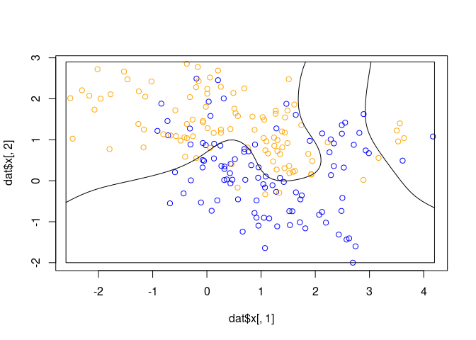
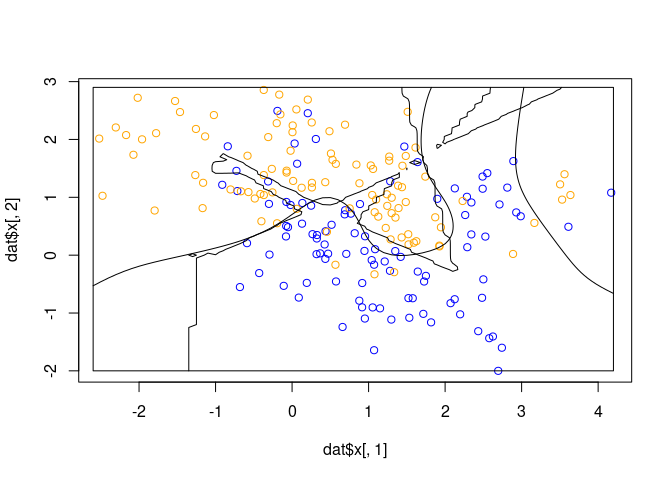
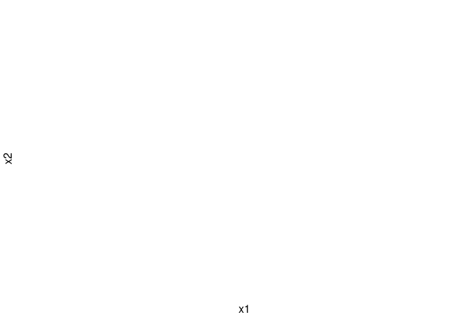
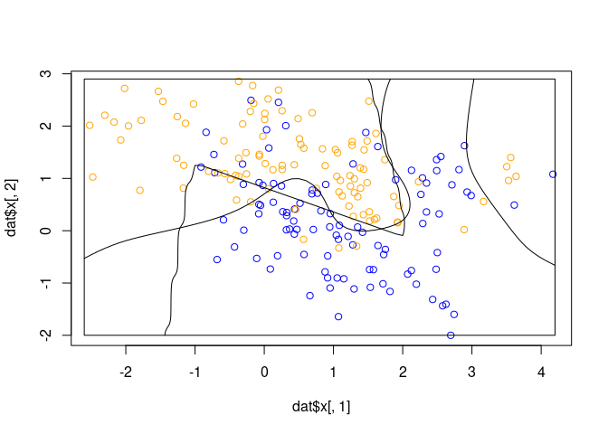
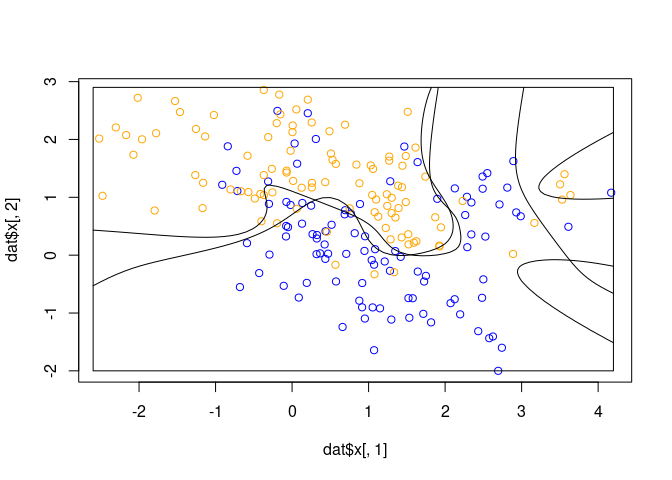
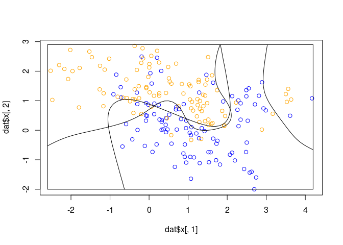

hw07
================
Hamza
5/1/2022

``` r
library(keras)
```

``` r
library('rgl')
```

    ## This build of rgl does not include OpenGL functions.  Use
    ##  rglwidget() to display results, e.g. via options(rgl.printRglwidget = TRUE).

``` r
library('nnet')

load("mixture.example.RData")
dat <- mixture.example
ddat <- data.frame(y=dat$y, x1=dat$x[,1], x2=dat$x[,2])


## create 3D plot of mixture data
plot_mixture_data <- function(dat=mixture.example, showtruth=FALSE) {
  plot(dat$xnew[,1], dat$xnew[,2], type = 'n',
       xlab="x1", ylab="x2",
       axes=FALSE )

## plot points and bounding box
x1r <- range(dat$px1)
x2r <- range(dat$px2)
pts <- plot(dat$x[,1], dat$x[,2], 
              type="p",
              col=ifelse(dat$y, "orange", "blue"))
lns <- lines(x1r[c(1,2,2,1,1)], x2r[c(1,1,2,2,1)])

## draw Bayes (True) classification boundary in blue
dat$probm <- with(dat, matrix(prob, length(px1), length(px2)))
dat$cls <- with(dat, contourLines(px1, px2, probm, levels=0.5))
pls0 <- lapply(dat$cls, function(p) lines(p$x, p$y, color="blue"))

## compute probabilities plot classification boundary
## associated with local linear logistic regression
probs.loc <- 
  apply(dat$xnew, 1, function(x0) {
    ## smoothing parameter
    l <- 1/2
    ## compute (Gaussian) kernel weights
    d <- colSums((rbind(ddat$x1, ddat$x2) - x0)^2)
    k <- exp(-d/2/l^2)
    ## local fit at x0
    fit <- suppressWarnings(glm(y ~ x1 + x2, data=ddat, weights=k,
                                family=binomial(link="logit")))
    ## predict at x0
    as.numeric(predict(fit, type="response", newdata=as.data.frame(t(x0))))
  })

dat$probm.loc <- with(dat, matrix(probs.loc, length(px1), length(px2)))
dat$cls.loc <- with(dat, contourLines(px1, px2, probm.loc, levels=0.5))
pls <- lapply(dat$cls.loc, function(p) lines3d(p$x, p$y,))

## plot probability surface and decision plane
sfc <- surface3d(dat$px1, dat$px2, probs.loc, alpha=1.0,
                 color="gray", specular="gray")
qds <- quads3d(x1r[c(1,2,2,1)], x2r[c(1,1,2,2)], 0.5, alpha=0.4,
               color="gray", lit=FALSE)
}

plot_nnet_predictions <- function(fit, dat=mixture.example) {
  
  ## create figure
  plot_mixture_data()

  ## compute predictions from nnet
  probs <- predict(fit, dat$xnew, type="raw")[,1]
  probm <- matrix(probs, length(dat$px1), length(dat$px2))
  cls <- contourLines(dat$px1, dat$px2, probm, levels=0.5)
  rslt <- sapply(cls, lines, col='black')
}


## plot data and 'true' probability surface
plot_mixture_data(showtruth=TRUE)
```

<!-- -->

    ## Warning in plot.xy(xy.coords(x, y), type = type, ...): "color" is not a
    ## graphical parameter

    ## Warning in plot.xy(xy.coords(x, y), type = type, ...): "color" is not a
    ## graphical parameter

<!-- -->

## fit single hidden layer, fully connected NN

## 10 hidden nodes

``` r
fit <- nnet(x=dat$x, y=dat$y, size=10, entropy=TRUE, decay=0)
```

    ## # weights:  41
    ## initial  value 135.550847 
    ## iter  10 value 99.952029
    ## iter  20 value 96.495520
    ## iter  30 value 80.979370
    ## iter  40 value 68.981957
    ## iter  50 value 58.887803
    ## iter  60 value 57.259561
    ## iter  70 value 56.940183
    ## iter  80 value 56.871034
    ## iter  90 value 56.868107
    ## iter 100 value 56.866778
    ## final  value 56.866778 
    ## stopped after 100 iterations

``` r
plot_nnet_predictions(fit)
```

<!-- -->

    ## Warning in plot.xy(xy.coords(x, y), type = type, ...): "color" is not a
    ## graphical parameter

    ## Warning in plot.xy(xy.coords(x, y), type = type, ...): "color" is not a
    ## graphical parameter

<!-- -->

## count total parameters

## hidden layer w/10 nodes x (2 + 1) input nodes = 30

## output layer w/1 node x (10 + 1) hidden nodes = 11

## 41 parameters total

``` r
length(fit$wts)
```

    ## [1] 41

``` r
# 3 hidden nodes
 nnet(x=dat$x, y=dat$y, size=3, entropy=TRUE, decay=0) %>%
 plot_nnet_predictions
```

<!-- -->

    ## Warning in plot.xy(xy.coords(x, y), type = type, ...): "color" is not a
    ## graphical parameter

    ## Warning in plot.xy(xy.coords(x, y), type = type, ...): "color" is not a
    ## graphical parameter

<!-- -->

    ## # weights:  13
    ## initial  value 143.460564 
    ## iter  10 value 102.026996
    ## iter  20 value 99.563217
    ## iter  30 value 92.379076
    ## iter  40 value 86.950700
    ## iter  50 value 86.203290
    ## iter  60 value 85.492460
    ## iter  70 value 85.452563
    ## iter  80 value 85.370752
    ## iter  90 value 85.164585
    ## iter 100 value 85.024083
    ## final  value 85.024083 
    ## stopped after 100 iterations

``` r
# 10 hidden nodes with weight decay
nnet(x=dat$x, y=dat$y, size=10, entropy=TRUE, decay=0.02) %>%
  plot_nnet_predictions
```

<!-- -->

    ## Warning in plot.xy(xy.coords(x, y), type = type, ...): "color" is not a
    ## graphical parameter

    ## Warning in plot.xy(xy.coords(x, y), type = type, ...): "color" is not a
    ## graphical parameter

<!-- -->

    ## # weights:  41
    ## initial  value 158.008569 
    ## iter  10 value 101.233358
    ## iter  20 value 100.014619
    ## iter  30 value 96.400447
    ## iter  40 value 93.422128
    ## iter  50 value 91.068336
    ## iter  60 value 88.067316
    ## iter  70 value 85.942724
    ## iter  80 value 85.440566
    ## iter  90 value 85.119248
    ## iter 100 value 84.750619
    ## final  value 84.750619 
    ## stopped after 100 iterations

``` r
# 3 hidden nodes with weight decay
nnet(x=dat$x, y=dat$y, size=3, entropy=TRUE, decay=0.02) %>%
  plot_nnet_predictions
```

<!-- -->

    ## Warning in plot.xy(xy.coords(x, y), type = type, ...): "color" is not a
    ## graphical parameter

    ## Warning in plot.xy(xy.coords(x, y), type = type, ...): "color" is not a
    ## graphical parameter

<!-- -->

    ## # weights:  13
    ## initial  value 147.951334 
    ## iter  10 value 100.557957
    ## iter  20 value 95.256324
    ## iter  30 value 94.215814
    ## iter  40 value 94.015208
    ## final  value 94.013481 
    ## converged

``` r
model <- keras_model_sequential()
```

    ## Loaded Tensorflow version 2.8.0

``` r
model %>%
  layer_dense(units = 30, activation = 'relu', input_shape = c(2))%>%
  layer_dense(units = 10, activation = 'relu') %>%
  layer_dense(units = 1, activation = 'sigmoid')
```

``` r
model %>% compile(
  optimizer = 'adam', 
  loss = "binary_crossentropy",
  metrics = c("accuracy")
)
```

``` r
model %>% fit(dat$x, dat$y, epochs = 5, verbose = 2)
```

Predictions are quite similar to the nnet package
